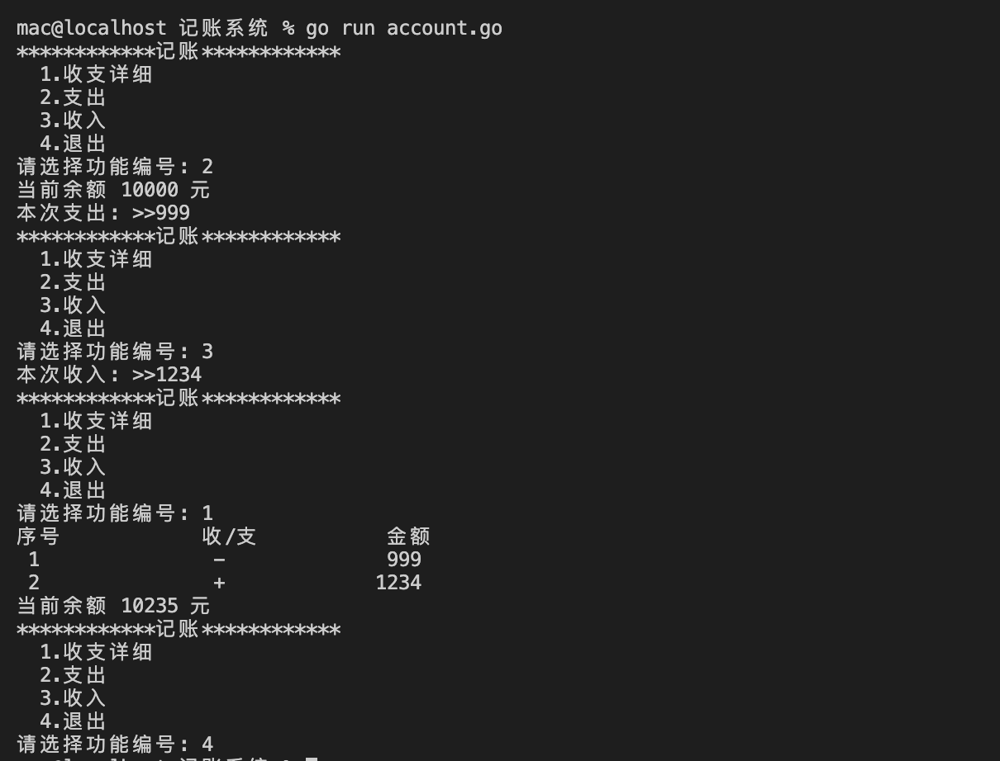

# 记账小程序(一)


## 需求说明

记账系统能够记录收入、支出，并能够打印收支明细表。


## 技能点

1. Scanf 函数
2. Printf 函数 格式化
3. map 集合
4. array 数组
5. slice 切片


## 实现效果


 


## 程序源码

```go
package main

import (
	"fmt"
	"os"
)

const LINE string = "************"

func menu() {
	fmt.Println(LINE + "记账" + LINE)
	fmt.Printf("%8.10s\n", "1.收支详细")
	fmt.Printf("%6.10s\n", "2.支出")
	fmt.Printf("%6.10s\n", "3.收入")
	fmt.Printf("%6.10s\n", "4.退出")
}

func main() {
	// 初始化变量
	var money int = 10000
	item := []map[string]string{}
	// for 循环
	for {
		var no int
		menu()
		fmt.Printf("请选择功能编号: ")
		fmt.Scanf("%d", &no)
		switch no {
		case 1:
			// 收支详细
			fmt.Println("序号		收/支		金额")
			// 顺序
			for i := 0; len(item) > i; i++ {
				for sz := range item[i] {
					fmt.Printf("%2d%16.20s%17s\n", i+1, sz, item[i][sz])
				}
			}
			fmt.Printf("当前余额 %d 元\n", money)
		case 2:
			// 支出
			var expenditure int
			fmt.Printf("当前余额 %d 元\n", money)
			fmt.Printf("本次支出: >>")
			fmt.Scanf("%d", &expenditure)
			money = money - expenditure
			expenditureStr := fmt.Sprintf("%d", expenditure)
			// 追加到item数组列表
			item = append(item, map[string]string{"-": expenditureStr})
		case 3:
			// 收入
			var earning int
			fmt.Printf("本次收入: >>")
			fmt.Scanf("%d", &earning)
			money = money + earning
			earningStr := fmt.Sprintf("%d", earning)
			// 追加到item数组列表
			item = append(item, map[string]string{"+": earningStr})
		case 4:
			// 退出
			os.Exit(0)
		}
	}
}
```


### 重要代码点解读

支出和收入功能，主要实现逻辑：定义item数组，将金额记录map格式中，多次支出/收入则追加数组中，收入详细功能，for循环遍历数组即可。

```go
item := []map[string]string{}

...

// 支出
var expenditure int
fmt.Printf("当前余额 %d 元\n", money)
fmt.Printf("本次支出: >>")
fmt.Scanf("%d", &expenditure)
money = money - expenditure
expenditureStr := fmt.Sprintf("%d", expenditure)
// 追加到item数组列表
item = append(item, map[string]string{"-": expenditureStr})
```


